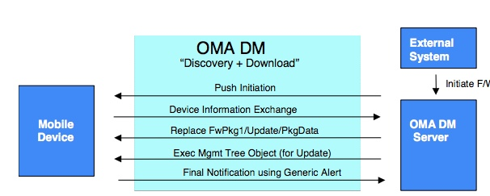
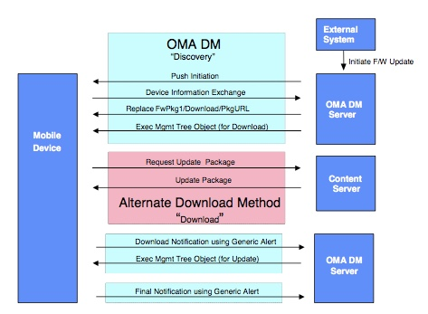

# 10.4 FUMO Usage FUMO 用法

## 10.4.1 Firmware Update Protocol Overview 固件更新协议概述
The Firmware Update Protocol specifies a set of standard commands with associated parameters and management objects that shall be used for OTA firmware updates.  OTA Firmware updates require special attention to handle the discovery, security, download and installation.  <br/>
固件更新协议指定一组具有相关参数和管理对象的标准命令，这些参数和管理对象将用于OTA固件更新。OTA固件更新需要特别注意处理发现，安全，下载和安装等方面事宜。

OMA DM is the leading standards initiative that focuses on device management for wireless devices.  The OMA Download specification [DLOTA] provides a flexible protocol for enabling the download of generic content, controlled through the use of a separate download descriptor.  By drawing on elements of these protocols and adding new elements, an effective protocol is constructed that combines Device Management [DMPRO] for controlling the main device management functions and provides for the use of descriptor-based download mechanisms to download larger binary objects such as firmware updates.  The download process is abstracted to allow the use of either OMA DM (E.g., Add/Replace) or any suitable alternative download mechanisms (for example, a descriptor based download protocol such as OMA Download [DLOTA].).<br/>
OMA DM是主要针对无线设备的设备管理的领先标准计划。OMA下载规范[DLOTA]提供了一个灵活的协议，允许下载通用内容，通过使用单独的下载描述符进行控制。通过利用这些协议的元素和添加新的元素，构造有效的协议，其组合用于控制主要设备管理功能的设备管理[DMPRO]，并且提供使用基于描述符的下载机制来下载更大的二进制对象，例如固件更新。抽象下载过程以允许使用OMA DM（例如，添加/替换）或任何合适的替代下载机制（例如，诸如OMA下载[DLOTA]的基于描述符的下载协议）。

The protocol shall support the following process steps in order to achieve an OTA firmware update:<br/>
协议应支持以下过程步骤以实现OTA固件更新：
1. 	Firmware Update Step 1: Firmware Update Initiation<br/>
固件更新步骤1：固件更新启动
2. 	Firmware Update Step 2: Device Information Exchange<br/>
固件更新步骤2：设备信息交换

3.	Firmware Update Step 3: Firmware Download<br/>
固件更新步骤3：固件下载

4.	Firmware Update Step 4: Firmware Installation<br/>
固件更新步骤4：固件安装

5.	Firmware Update Step 5: Notification of Firmware Update<br/>
固件更新步骤5：固件更新通知

## 10.4.1.1 Scenario 1: Firmware Update via OMA DM Download (Replace)  场景1：通过OMA DM更新固件下载（替换）
The following example shows how OMA DM is used directly to move a firmware update package to the device using a DM “Replace” command to access a management object representing the actual firmware binary package data:<br/>
以下示例显示如何使用OMA DM直接使用DM“Replace”命令将固件更新包移动到设备，以访问表示实际固件二进制包数据的管理对象：

## 10.4.1.2 Scenario 2: Firmware Update through an Alternative Download Mechanism 场景2：通过备用下载机制更新固件
The following examples shows how OMA DM is used to invoke an external download method, using a DM “Replace” command to specify the URL of the download descriptor that describes further details concerning the firmware package and the download method to be used:<br/>
以下示例显示如何使用OMA DM调用外部下载方法，使用DM“Replace”命令指定有关固件包和要使用的下载方法的下载描述符的URL：

### 10.4.1.2.1 Example 1: ‘Exec’ on x/Download node + ‘Exec’ on x/Update node 示例1：在x /Download节点上'Exec'，在x /Update节点上'Exec'

### 10.4.1.2.2 Example 2: ‘Exec’ on x/DownloadAndUpdate node 示例2：x / DownloadAndUpdate节点上“Exec”
The server issues an ‘Exec’ command targeting the x/DownloadAndUpdate node. Client sends final notification to server after the completion of DownloadAndUpdate operation.<br/>
服务器发出一个“Exec”命令，目标是x / DownloadAndUpdate节点。 完成DownloadAndUpdate操作后，客户端向服务器发送最终通知。

## 10.4.2 Protocol Definition 协议定义
### 10.4.2.1 Firmware Update Step1: Firmware Update Initiation 固件更新步骤1：固件更新启动
In order to begin any kind of firmware update, the device is required to open a data connection to the server. The following mechanisms could be supported to initiate the firmware update process:<br/>
为了开始任何类型的固件更新，设备需要打开到服务器的数据连接。可以支持以下机制来启动固件更新过程：

• User initiated<br/>
用户启动

• Network initiated<br/>
网络启动

The subscriber experience for user-initiated updates is not addressed in this specification as it does not require specific standardization. Recommended approaches are through menu items and service codes on the device. The user initiated update process would simply launch an OMA DM session.<br/>
在本规范中没有涉及用户发起的更新的用户体验，因为它不需要特定的标准化。推荐的方法是通过设备上的菜单项和服务代码。用户发起的更新过程将简单地启动OMA DM会话。

For network initiated updates, OMA Device Management provides a framework by which clients can be sent a “Notification Initiation Alert” to trigger the client to start the data session. It is the intent of the Firmware Update Protocol to leverage General Package#0 as specified in the OMA DM Notification Initiation Session document [DMNOTI]. OMA DM specifies that WAP Push can be used for this purpose and specifies a format acceptable for the purpose of firmware upgrade initiation.<br/>
对于网络发起的更新，OMA设备管理提供了一个框架，通过该框架可以向客户端发送“通知发起警报”以触发客户端开始数据会话。固件更新协议的目的是利用在OMA DM通知发起会话文档[DMNOTI]中指定的通用包＃0。 OMA DM指定WAP推送可以用于此目的，并且指定可接受的格式以用于固件升级启动的目的。

### 10.4.2.2 Firmware Update Step 2: Device Information Exchange 固件更新步骤2：设备信息交换
In order to provide a device with the appropriate firmware update, a minimum set of selection criteria is sent by the device to the server. For the purpose of the firmware updates, the minimum set of criteria is the required DevInfo parameters that are mandatory for each OMA DM management session as specified in [DMSTDOBJ, Section 5].<br/>
为了向设备提供适当的固件更新，设备向服务器发送一组最小的选择标准。为了固件更新的目的，最小标准集是对于如在[DMSTDOBJ，第5节]中规定的每个OMA DM管理会话必需的所需DevInfo参数。

NOTE: The device information exchange can be followed by an optional user interaction prior to the setup of the firmware download process described in the next section. An OMA DM “Alert” command can be used to seek user confirmation.<br/>
注意：在设置下一部分中描述的固件下载过程之前，设备信息交换后可以进行可选的用户交互。 OMA DM“Alert”命令可用于寻求用户确认。

### 10.4.2.3 Firmware Update Step 3: Firmware Download 固件更新步骤3：固件下载
The firmware download could occur either through an OMA DM ‘Replace’ command or via an alternative (external descriptor-based download) method by initiating the download process with the appropriate behavioural parameters. There are advantages and disadvantages to each process and it is at the discretion of the operators and manufacturers to select a preferred implementation. The protocol proposed here allows for either download method to be used.<br/>
通过启动具有适当行为参数的下载过程，可以通过OMA DM'替换'命令或通过替代（基于外部描述符的下载）方法来进行固件下载。 每个过程都有优点和缺点，并且操作者和制造商自行决定选择优选实施方式。 这里提出的协议允许使用下载方法。

### 10.4.2.4 Firmware Update Step 4: Firmware Installation 固件更新步骤4：固件安装
It is anticipated that there will be multiple methods available on the market to process firmware updates within a device. The firmware update specification’s intent is to standardize interoperability between devices and wireless network solutions. Therefore, this specification does not address the method of how a device must process the actual firmware update when it is independent of the network. Instead, this specification provides requirements to achieve an acceptable user experience for the firmware installation.<br/>
预期在市场上将有多种方法来处理设备内的固件更新。固件更新规范的目的是标准化设备和无线网络解决方案之间的互操作性。因此，本说明书不涉及当设备独立于网络时设备必须如何处理实际固件更新的方法。相反，本规范提供了为固件安装实现可接受的用户体验的要求。

### 10.4.2.4.1 Firmware Install after OMA DM Download 在OMA DM下载后的固件安装

The following Exec command initiates the update process in cases where the firmware update is downloaded into the PkgData element using OMA DM Replace:<br/>
在使用OMA DM Replace将固件更新下载到PkgData元素中的情况下，以下Exec命令启动更新过程：
```
<Exec>
  <CmdID>3</CmdID> 
  <Item>
    <Target> 
      <LocURI>.x/Update</LocURI>
    </Target> 
  </Item>
</Exec>
```