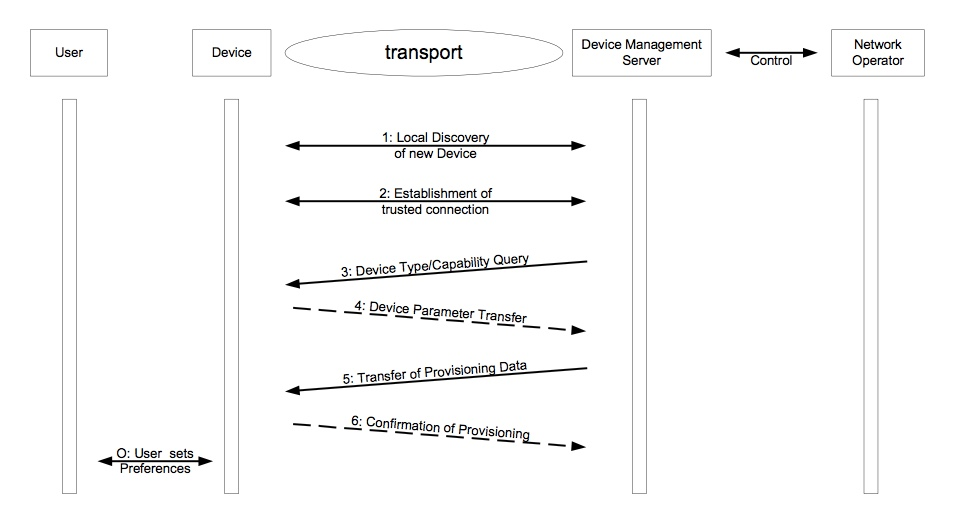
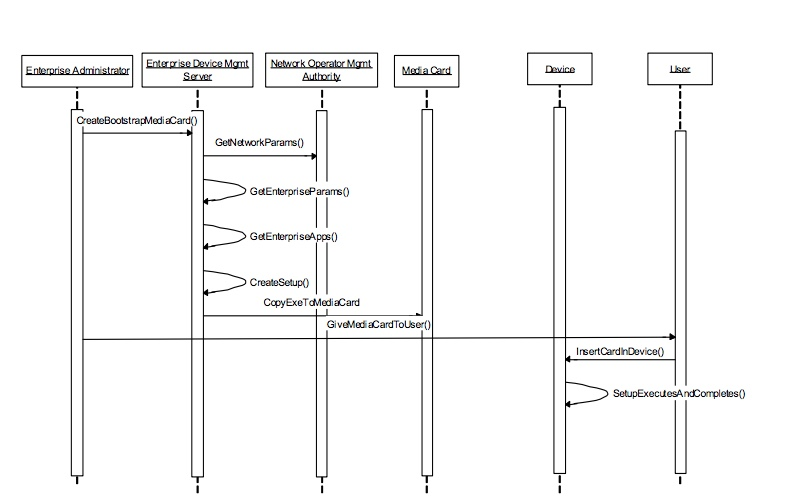

# 1.3 Description of Use Cases (Informative) 用例描述（资料性）

The use cases are classified into the following categories:
* Provisioning
* Configuration Maintenance/Management
* Software management
* Fault Detection, Query and Reporting
* Non-application Software Download

In the sub-clauses that follow describing the use cases, further flows may be required where they are required to meet functional, security, usability or business needs. For the sake of clarity these have been omitted.

用例分为以下几类：
* 配置
* 配置维护/管理
* 软件管理
* 故障检测，查询和报告
* 非应用软件下载

在描述用例的子条款中，如果需要满足功能，安全性，可用性或业务需要，可能需要进一步的流程。 为了清楚起见，省略了这些。
## 1.3.1 Provisioning 配置
###1.3.1.1 Provisioning 新设备购买
A new Device (e.g., a handset or PDA) is purchased by a network Subscriber in an authorised retail store and provisioned with parameters. The Device is powered on and store personnel at the retail outlet use a Device Management system to provision the Device with network-specific parameters (e.g. gateway addresses, etc.) that enable delivery of subscribed services, as well as User-specific preferences (e.g. message headers, etc.) as defined by the User. The Device provisioning can be done via a local or public transport mechanism, e.g. IR, Bluetooth, local, or non-local, wired, or wireless network. The new Device and all accompanying services are fully operational when the Subscriber leaves the store.
As a minimum, the retail store shall be able to provision the parameters described in section 1.5.  
新的设备（例如，手持机或PDA）由网络订阅者在授权的零售商店中购买并且提供参数。 设备通电并且在零售商店的工作人员使用设备管理系统来向设备传送订阅服务的网络特定参数（例如网关地址等）以及用户特定偏好（例如， 消息头等），由用户定义。 设备配置可以通过本地或公共传输机制来完成，例如IR，蓝牙，本地或非本地，有线或无线网络。 当用户离开商店时，新设备和所有伴随服务都可以完全运行。零售商店至少应能够提供1.5节中描述的参数。
####1.3.1.1.1 Actors and Data Authority 参与者和数据权威

* User/Subscriber. The User/Subscriber is authorised to define and change the User Preference parameters.
* Network Operator. The Network Operator is authorised to define and change the Network Parameters.
* Authorised agent of the Network Operator

* 用户/订阅者。 用户/订阅者有权限定义和更改用户首选项参数。 
* 网络运营商。 网络操作员有权定义和更改网络参数。
* 网络运营商的授权代理

####1.3.1.1.2 Pre-Conditions 前提条件

* User is the Subscriber and has purchased a service contract with the Network Operator.
* Authorised agent (e.g. a retail outlet) has a Device Management system for provisioning Devices.
* Device is capable of interfacing with the Device Management system.

* 用户是订户，并与网络运营商购买了服务合同。
* 授权代理（例如零售店）具有用于配置设备的设备管理系统。
* 设备能够与设备管理系统连接。 

####1.3.1.1.3 Post-Conditions 后条件
* Device is provisioned with parameters necessary to obtain the services the User/Subscriber has purchased.
* Device is configured with User-specific parameters as defined by the User.
* Network and service provider end points recognise the device as having authorisation to use the purchased services.
* Device and all purchased services are fully operational.

* 向设备提供获得用户/订户购买的服务所必需的参数。
* 设备配置有用户定义的用户特定参数。
* 网络和服务提供商端点将该设备识别为具有使用所购买的服务的授权。
* 设备和所有购买的服务全面运行。

####1.3.1.1.4 Variations 变动
The user purchases a device in retail market, on power on the device is automatically provisioned over the air. 
用户在零售市场中购买设备，在设备通电时，通过空中下载自动配置。

####1.3.1.1.4 Normal Flow 一般流程
1. Device is discovered by local Device Management infrastructure.
2. Trusted Relationship is established.
3. Device is queried for Type and Capabilities.
4. Type and Capabilities are transferred.
5. Provisioning data is transferred to Device.
6. Provisioning is confirmed.

O : Optional the User overwrites the predefined values for the User's preferences.

1. 设备由本地设备管理基础设施发现。
2. 建立可信关系。
3. 查询设备的类型和功能。
4. 传输类型和能力。
5. 配置数据传输到设备。
6. 确认配置。

O：可选用户将覆盖用户首选项的预定义值。

Remarks: The User Preference parameters should be changeable for the User in a comfortable way. The network parameters should be altered only by an authorized Management Server. 
备注：用户首选项参数应以舒适的方式为用户更改。 网络参数只能由授权的管理服务器更改。

If pre-configured Devices are brought in bulk by the operator, it should be possible for the operator to give a simple "Provisioning Content" XML file to the Device manufacturers, so that the Device (or the smart card) can be provisioned in factory. 
如果操作员大量引入预配置的设备，则操作员应该可以向设备制造商提供简单的“配置内容”XML文件，以便设备（或智能卡）可以在工厂配置。
###1.3.1.2 New Enterprise Device Purchase 新企业设备购买
A new Device (e.g., a handset or PDA) is purchased by an Enterprise Management Authority from a Device vendor. The Enterprise management system has also obtained Network parameters and software from the Network Operator and uses these with Enterprise specific parameters (as appropriate), Enterprise policy/preferences, Enterprise applications, and Enterprise security credentials to enable Enterprise use of the device. All this data is then used to create a set-up program for the device. The User receives and powers on the Device. The User then configures their device using the set-up program created by the Enterprise management authority. This set-up program can be communicated to the device using a removal media card, USB, Fire Wire, wireless network etc . The setup program is automatically executed and after a few seconds the Device is provisioned with WAN Network and all accompanying services/applications are fully operational after setup is complete. 
新的设备（例如，手机或PDA）由企业管理机构从设备供应商处购买后。 企业管理系统还应从网络运营商处获得网络参数和软件，并使用这些参数和企业特定参数（如适用），企业策略/首选项，企业应用程序和企业安全凭证，以支持企业使用设备。 之后，所有这些数据用于创建设备的设置程序。 用户接收设备打开电源并使用企业管理机构创建的设置程序配置其设备。 可以使用移除介质卡，USB，火线，无线网络等将该设置程序传送到设备。 安装程序自动执行，几秒钟后，设备将配置WAN网络，并且所有附带的服务/应用程序在安装完成后可以完全运行。
####1.3.1.2.1 Actors 参与者

* User
* Network Operator Management Authority 
* Enterprise Management Authority 
* Enterprise Administrator

* 用户
* 网络运营商管理机构
* 企业管理机构企业
* 管理员
####1.3.1.2.2 Pre-Conditions 前提条件
* User may be a Subscriber and has purchased a service contract with the Network Operator. 
* The Enterprise has a Device Management system.
* Device is capable of interfacing with the Device Management system.
* The Enterprise Management Authority has programmatic access to the appropriate WAN Network Bearer parameters established by the Network Operator Management Authority. This may involve partial transfer of Management Authority.

* 用户可以是订阅者，并且已经与网络运营商购买了服务合同。 
* 企业有一个设备管理系统。
* 设备能够与设备管理系统连接。
* 企业管理机构可以编程访问由网络运营商管理机构建立的适当的WAN网络承载参数。 这可能涉及管理权力的部分转移。
####1.3.1.2.3 Post-Conditions 后条件
Device is provisioned with parameters and applications necessary to connect to the enterprise network and run the installed enterprise applications. 
设备已配置连接到企业网络所需的参数和应用络并成功运行已安装的企业应用。

####1.3.1.2.4 Normal Flow 一般流程
1. Enterprise Administrator creates the contents of a removable media card.
    1. Device Mgmt Server (DMS) obtains the Network settings from the Network Operator.
    2. DMS obtains Enterprise parameters and applications.
    3. DMS writes the appropriate data and instructions to the media card.
2. Enterprise Administrator gives the media card to a User.
3. The User inserts the media card into a Device.
4. The setup runs and the device is appropriately configured.

1. 企业管理员创建可移动介质卡的内容。
    1. 设备管理服务器（DMS）从网络运营商获取网络设置。
    2. DMS获得企业参数和应用程序。
    3. DMS将适当的数据和指令写入介质卡。
2. 企业管理员将介质卡提供给用户。
3. 用户将媒体卡插入设备。
4. 设置运行并且设备已正确配置。

