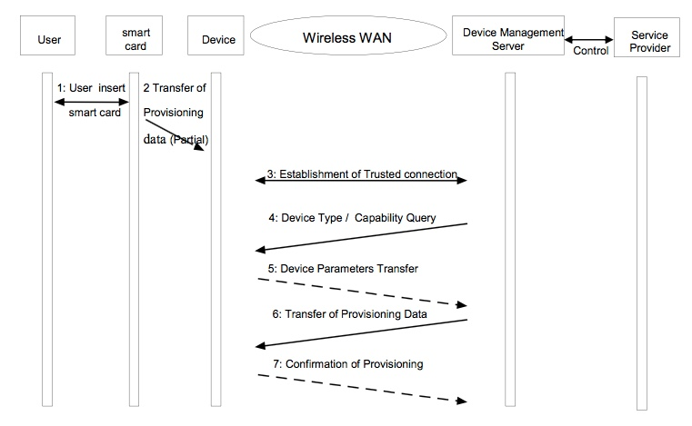
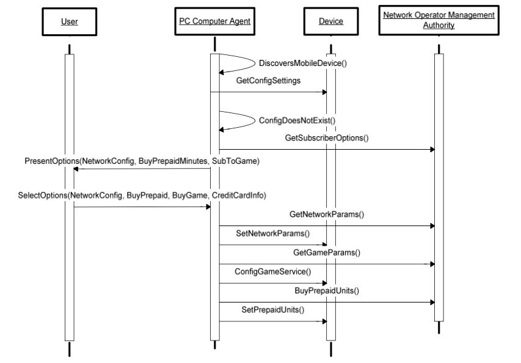
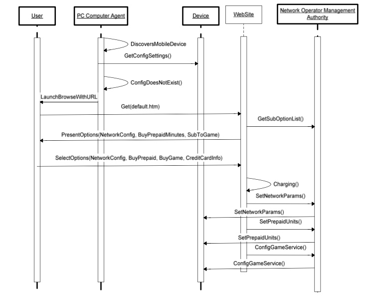

# 1.3 Description of Use Cases (Informative) 用例描述（资料性）

The use cases are classified into the following categories:
* Provisioning
* Configuration Maintenance/Management
* Software management
* Fault Detection, Query and Reporting
* Non-application Software Download

In the sub-clauses that follow describing the use cases, further flows may be required where they are required to meet functional, security, usability or business needs. For the sake of clarity these have been omitted.

用例分为以下几类：
* 配置
* 配置维护/管理
* 软件管理
* 故障检测，查询和报告
* 非应用软件下载

在描述用例的子条款中，如果需要满足功能，安全性，可用性或业务需要，可能需要进一步的流程。 为了清楚起见，省略了这些。
## 1.3.1 Provisioning 配置
###1.3.1.1 New Device Purchase 新设备购买
A new Device (e.g., a handset or PDA) is purchased by a network Subscriber in an authorised retail store and provisioned with parameters. The Device is powered on and store personnel at the retail outlet use a Device Management system to provision the Device with network-specific parameters (e.g. gateway addresses, etc.) that enable delivery of subscribed services, as well as User-specific preferences (e.g. message headers, etc.) as defined by the User. The Device provisioning can be done via a local or public transport mechanism, e.g. IR, Bluetooth, local, or non-local, wired, or wireless network. The new Device and all accompanying services are fully operational when the Subscriber leaves the store.
As a minimum, the retail store shall be able to provision the parameters described in section 1.5.  
新的设备（例如，手持机或PDA）由网络订阅者在授权的零售商店中购买并且提供参数。 设备通电并且在零售商店的工作人员使用设备管理系统来向设备传送订阅服务的网络特定参数（例如网关地址等）以及用户特定偏好（例如， 消息头等），由用户定义。 设备配置可以通过本地或公共传输机制来完成，例如IR，蓝牙，本地或非本地，有线或无线网络。 当用户离开商店时，新设备和所有伴随服务都可以完全运行。零售商店至少应能够提供1.5节中描述的参数。
####1.3.1.1.1 Actors and Data Authority 参与者和数据权威

* User/Subscriber. The User/Subscriber is authorised to define and change the User Preference parameters.
* Network Operator. The Network Operator is authorised to define and change the Network Parameters.
* Authorised agent of the Network Operator

* 用户/订阅者。 用户/订阅者有权限定义和更改用户首选项参数。 
* 网络运营商。 网络操作员有权定义和更改网络参数。
* 网络运营商的授权代理

####1.3.1.1.2 Pre-Conditions 前提条件

* User is the Subscriber and has purchased a service contract with the Network Operator.
* Authorised agent (e.g. a retail outlet) has a Device Management system for provisioning Devices.
* Device is capable of interfacing with the Device Management system.

* 用户是订户，并与网络运营商购买了服务合同。
* 授权代理（例如零售店）具有用于配置设备的设备管理系统。
* 设备能够与设备管理系统连接。 

####1.3.1.1.3 Post-Conditions 后条件
* Device is provisioned with parameters necessary to obtain the services the User/Subscriber has purchased.
* Device is configured with User-specific parameters as defined by the User.
* Network and service provider end points recognise the device as having authorisation to use the purchased services.
* Device and all purchased services are fully operational.

* 向设备提供获得用户/订户购买的服务所必需的参数。
* 设备配置有用户定义的用户特定参数。
* 网络和服务提供商端点将该设备识别为具有使用所购买的服务的授权。
* 设备和所有购买的服务全面运行。

####1.3.1.1.4 Variations 变动
The user purchases a device in retail market, on power on the device is automatically provisioned over the air. 
用户在零售市场中购买设备，在设备通电时，通过空中下载自动配置。

####1.3.1.1.5 Normal Flow 一般流程
1. Device is discovered by local Device Management infrastructure.
2. Trusted Relationship is established.
3. Device is queried for Type and Capabilities.
4. Type and Capabilities are transferred.
5. Provisioning data is transferred to Device.
6. Provisioning is confirmed.

O : Optional the User overwrites the predefined values for the User's preferences.

1. 设备由本地设备管理基础设施发现。
2. 建立可信关系。
3. 查询设备的类型和功能。
4. 传输类型和能力。
5. 配置数据传输到设备。
6. 确认配置。

O：可选项为用户将覆盖用户首选项的预定义值。

Remarks: The User Preference parameters should be changeable for the User in a comfortable way. The network parameters should be altered only by an authorized Management Server. 
备注：用户首选项参数应以舒适的方式为用户更改。 网络参数只能由授权的管理服务器更改。

If pre-configured Devices are brought in bulk by the operator, it should be possible for the operator to give a simple "Provisioning Content" XML file to the Device manufacturers, so that the Device (or the smart card) can be provisioned in factory. 
如果操作员大量引入预配置的设备，则操作员应该可以向设备制造商提供简单的“配置内容”XML文件，以便设备（或智能卡）可以在工厂配置。
###1.3.1.2 New Enterprise Device Purchase 新企业设备购买
A new Device (e.g., a handset or PDA) is purchased by an Enterprise Management Authority from a Device vendor. The Enterprise management system has also obtained Network parameters and software from the Network Operator and uses these with Enterprise specific parameters (as appropriate), Enterprise policy/preferences, Enterprise applications, and Enterprise security credentials to enable Enterprise use of the device. All this data is then used to create a set-up program for the device. The User receives and powers on the Device. The User then configures their device using the set-up program created by the Enterprise management authority. This set-up program can be communicated to the device using a removal media card, USB, Fire Wire, wireless network etc . The setup program is automatically executed and after a few seconds the Device is provisioned with WAN Network and all accompanying services/applications are fully operational after setup is complete. 
新的设备（例如，手机或PDA）由企业管理机构从设备供应商处购买后。 企业管理系统还应从网络运营商处获得网络参数和软件，并使用这些参数和企业特定参数（如适用），企业策略/首选项，企业应用程序和企业安全凭证，以支持企业使用设备。 之后，所有这些数据用于创建设备的设置程序。 用户接收设备打开电源并使用企业管理机构创建的设置程序配置其设备。 可以使用移除介质卡，USB，火线，无线网络等将该设置程序传送到设备。 安装程序自动执行，几秒钟后，设备将配置WAN网络，并且所有附带的服务/应用程序在安装完成后可以完全运行。
####1.3.1.2.1 Actors 参与者

* User
* Network Operator Management Authority 
* Enterprise Management Authority 
* Enterprise Administrator

* 用户
* 网络运营商管理机构
* 企业管理机构企业
* 管理员

####1.3.1.2.2 Pre-Conditions 前提条件
* User may be a Subscriber and has purchased a service contract with the Network Operator. 
* The Enterprise has a Device Management system.
* Device is capable of interfacing with the Device Management system.
* The Enterprise Management Authority has programmatic access to the appropriate WAN Network Bearer parameters established by the Network Operator Management Authority. This may involve partial transfer of Management Authority.

* 用户可以是订阅者，并且已经与网络运营商购买了服务合同。 
* 企业有一个设备管理系统。
* 设备能够与设备管理系统连接。
* 企业管理机构可以编程访问由网络运营商管理机构建立的适当的WAN网络承载参数。 这可能涉及管理权力的部分转移。

####1.3.1.2.3 Post-Conditions 后条件
Device is provisioned with parameters and applications necessary to connect to the enterprise network and run the installed enterprise applications. 
设备已配置连接到企业网络所需的参数和应用络并成功运行已安装的企业应用。

####1.3.1.2.4 Normal Flow 一般流程
1. Enterprise Administrator creates the contents of a removable media card.
    1. Device Mgmt Server (DMS) obtains the Network settings from the Network Operator.
    2. DMS obtains Enterprise parameters and applications.
    3. DMS writes the appropriate data and instructions to the media card.
2. Enterprise Administrator gives the media card to a User.
3. The User inserts the media card into a Device.
4. The setup runs and the device is appropriately configured.

1. 企业管理员创建可移动介质卡的内容。
    1. 设备管理服务器（DMS）从网络运营商获取网络设置。
    2. DMS获得企业参数和应用程序。
    3. DMS将适当的数据和指令写入介质卡。
2. 企业管理员将介质卡提供给用户。
3. 用户将媒体卡插入设备。
4. 设置运行并且设备已正确配置。

###1.3.1.3 Smart Card based Provisioning 基于智能卡的配置
A smart card is inserted into the Device for the first time. The smart card contains pre-configured service parameters that enable access to a Service Provider’s infrastructure and a key that allows to establish a trust connection to the Device Management system. The User inserts the smart card into the Device and the Device is provisioned (with optional user interaction) with parameters from the smart card. Upon use, the Device then establishes a relation to the Service Provider’s management server in the network. 
首次将智能卡插入设备。 智能卡包含预配置的服务参数，用于访问服务提供商的基础设施和允许建立与设备管理系统的信任连接的密钥。 用户将智能卡插入设备，并使用智能卡的参数配置设备（可选择与用户交互）。 在使用时，设备建立与网络服务提供商的管理服务器的关系。

####1.3.1.3.1 Actors and Data Authority 参与者和数据权威
* User/Subscriber 
* Service Provider

* 用户/订阅者
* 服务提供商

####1.3.1.3.2 Pre-Conditions 前提条件
* The User/Subscriber has established a contractual relationship with the Service Provider for service and has obtained a pre-configured smart card with a key (Issuing aspects of the smart card are not within scope of this document). 
用户/订户已经与服务提供商建立了服务的合同关系，并且已经获得具有密钥的预配置的智能卡（智能卡的发布方面不在本文档的范围内）。
* The Device is equipped with a Device Management User Agent 
  设备配备了设备管理用户代理
* The Device is equipped with an User Agent associated with the pre-configured service, if required (or the Device has the ability to download such a User Agent) 
如果需要（或者设备具有下载这样的用户代理的能力），设备配备有与预先配置的服务相关联的用户代理

####1.3.1.3.3 Post-Conditions 后条件
The Device is fully provisioned with parameters necessary to allow delivery of the purchased service. 
设备已完全配置了允许交付已购买服务所必需的参数。

####1.3.1.3.4 Variations 变动
1. Instead of having parameters pre-configured on the smart card, the card could contain only a key that enables establishment of a trust relationship with the Service Provider’s management server. Service parameters could then be subsequently provisioned onto the Device by the Service Provider over the air. 
尽管可以在智能卡上预先配置参数，但智能卡可以仅包含能够建立与服务提供商的管理服务器的信任关系的密钥。 服务参数可以随后由服务提供商通过空中下载提供到设备上。

2. Instead of purchasing a new smart card with a Device, a Subscriber could purchase a service from a Service Provider and have their existing smart card configured with parameters or keys by an entity with Management Authority of the smart card. 
尽管可以在购买新设备时附带新的智能卡，但订户可以从服务提供商购买服务，并且通过具有智能卡的管理权限的实体配置过的现有智能卡配置参数或密钥。

####1.3.1.3.5 Normal Flow 一般流程
1. The User inserts the smart card into the Device.
2. If applicable (parts of) provisioning data is transferred from the smart card to the Device.
3. With the key on the smart card a trusted connection is established between the Device and the Device Management server.
4. The Device Management server queries the Device for actual configuration.
5. The Device responses to the query.
6. The relevant provisioning data is downloaded towards the Device.
7. The Transfer of the Provisioning data is confirmed.

1. 用户将智能卡插入设备。
2. 配置数据从智能卡传输到设备（如适用）。
3. 使用智能卡上的密钥，在设备和设备管理服务器之间建立信任的连接。
4. 设备管理服务器查询设备的实际配置。
5. 设备对查询的响应。
6. 向设备下载相关的配置数据。
7. 确认配置数据传输。

####1.3.1.3.6 Alternative Flow 替代流程
As described in variation 1 the trusted relationship can be established without prior transfer of provisioning data from the smart card to the Device (omission of step 2). 
如变动1中所述，可以在没有从智能卡到设备的预配置数据的预先传送（省略步骤2）的情况下建立信任关系。

###1.3.1.4 Bootstrap Provisioning for used Devices 已使用设备的引导配置
A Subscriber acquires a Device outside the operator's normal sales lines, e.g. second-hand. An inappropriate configuration in this case is very likely. The only connection to the operator is the smart card, where applicable. The Subscriber's first time use of the Device is detected automatically by the operator's infrastructure. 
订户在运营商的正常销售线路之外获取设备，例如二手。在这种情况下非常可能出现不适当的配置。与运营商的唯一连接是智能卡（如果适用）。订户首次使用设备由运营商的基础设施自动检测。

Alternatively the Subscriber asks explicitly for a configuration parameter set, e.g. by Customer care call or an abbreviated dialling request. The characteristics of the Device (e.g., Device capabilities, resident applications, configuration parameters) are determined and transmitted to the operator's management server. The appropriate provisioning parameters are transferred to the Device; optionally after a confirmation by the Subscriber. In addition User-specific preferences are defined by the User. 
或者，订户明确地请求配置参数集，例如。通过客户服务呼叫或缩写拨号请求。确定设备的特性（例如，设备能力，驻留应用，配置参数）并将其传输到运营商的管理服务器。将适当的设置参数传输到设备；可选地在订阅者确认之后。此外，用户特定的首选项由用户定义。

Difference to the use case in section 1.3.1.3 is that here already inserted configuration data has to be overridden; the Device is not in a 'fresh' state, but might be highly mis-configured, so standard values do not necessarily apply. 
与第1.3.1.3节中的用例区别在于，必须覆盖已插入的配置数据；设备不处于“新鲜”状态，但可能是高度错误配置，因此标准值不一定适用。

####1.3.1.4.1 Actors and Data Authority 参与者和数据权威
* Subscriber: The Subscriber has decided to connect to a particular Network Operator.
* User : The User is authorised to define and change the User Preference Parameter.
* Network Operator: The selected Network Operator is authorised to define and change the Network Configuration Data.

* 订户：订户已决定连接到特定的网络运营商。
* 用户：用户有权定义和更改用户首选项参数。
* 网络运营商：所选的网络运营商有权定义和更改网络配置数据。

####1.3.1.4.2 Pre-Conditions 前提条件
* The Subscriber has purchased a service contract with the Network Operator.
* Device is capable of interfacing with the Device Management system.

* 订户已向网络运营商购买服务合同。
* 设备能够与设备管理系统连接。

####1.3.1.4.3 Post-Conditions 后条件

* Device is provisioned with parameters necessary to obtain the services the User/Subscriber has purchased.
* Device is configured with User-specific parameters as defined by the User.
* Device and all purchased services are fully operational.

* 为设备提供获取用户/订阅者购买的服务所必需的参数。
* 设备配置有用户定义的用户特定参数。
* 设备和所有购买的服务全面运行。

####1.3.1.4.4 Normal Flow 一般流程
1. User inserts smart card (where applicable)
2. Radio Network detects a new combination of Subscriber (e.g. IMSI) and Device (e.g. IMEI).
3. Establishment of trusted relationship between Device and Device Management Server.
4. Management server queries the Device for its capabilities
5. Device responses to the request
6. Appropriate configuration is transferred by the Device Management Server.
7. The provisioning of the Device is confirmed.

1. 用户插入智能卡（如适用）
2. 无线电网络检测到订户（例如IMSI）和设备（例如，IMEI）的新组合。
3. 在设备和设备管理服务器之间建立信任关系。
4. 管理服务器查询设备的功能
5. 设备对请求的响应
6. 适当的配置由设备管理服务器传送。
7. 确认设备的配置。

####1.3.1.4.5 Alternative Flow 替代流程
The Device Management data transfer is triggered by the User. In this case step 2 is replaced by the User's request. 
设备管理数据传输由用户触发。在这种情况下，步骤2由用户的请求替代。

###1.3.1.5 Subscriber provisioning through the PC 通过PC的用户配置
A new Device is purchased by the User via the Internet from a Device vendor. The User receives the Device from the vendor. 
用户通过互联网从设备供应商购买新设备。 用户从供应商处接收设备。

To provision the Device the User places the new Device in proximity to their PC. The PC Agent discovers the Device. The User is prompted to ask if they wish to provision the Device, after an affirmation of consent the PC Agent connects to the Network Management Authority. 
为了设置设备，用户将新设备放置在他们的PC附近。 PC代理发现设备。 在PC代理连接到网络管理机构的同意确认后，提示用户询问他们是否希望配置设备。

The User is then presented with options on the PC UI and is stepped through the process of provisioning the Device via a secure Network connection. The User selects to configure network settings, add additional prepaid minutes and selects the game service. The User enters their personal and credit card information and confirms the transaction. Upon completion of a credential check the Network Management Authority provisions the device via the PC Agent. 
然后向用户呈现PC UI上的选项，并且进入通过经由安全网络连接配置设备的过程。 用户选择配置网络设置，添加额外的预付分钟并选择游戏服务。 用户输入他们的个人信息和信用卡信息并确认交易。 在完成凭证检查后，网络管理机构通过PC代理配置设备。

####1.3.1.5.1 Actors 参与者
* User
* Network Operator 
* Management Authority
* PC Agent

* 用户
* 网络运营商
* 管理机构
* PC代理

####1.3.1.5.2 Pre-Conditions 前提条件
* User may be a Subscriber and has purchased a service contract with the Network Operator.
* PC Agent is capable of interfacing with the Network Management Authority.
* PC Agent is capable of interfacing with the Device.
* PC Agent has obtained mechanism to access the Network Management Authority.
* PC Agent is present on the PC.
* Device is capable of interfacing with the Network Management Authority (variation 1).
* User has obtained mechanism to access and log into Network Management Authority website (variation 1).

* 用户可能是订阅者，并与网络运营商购买了服务合同。
* PC代理能够与网络管理机构连接。
* PC代理能够与设备连接。
* PC代理已获取访问网络管理权限的机制。
* PC代理存在于PC上。
* 设备能够与网络管理机构连接（变动1）。
* 用户已获得访问和登录网络管理机构网站的机制（变动1）。

####1.3.1.5.3 Post-Conditions 后条件
* The Device has network connectivity.
* The Subscriber has more prepaid minutes on their account.
* The appropriate applications are installed and server side service provisioning is complete.

* 设备具有网络连接。
* 订阅者在其帐户上有更多的预付分钟。
* 安装相应的应用程序，并完成服务器端服务配置。

####1.3.1.5.4 Variations 变动
1. The Device provisioning can be performed via an OTA mechanism between the Network Management Authority and the Device.
2. The User while sitting in front of their computer places the Device in proximity of the PC. The PC Agent discovers the Device and interrogates the Device for the number of available service minutes. If the service minutes are below a preconfigured limit the PC Agent prompts the User if they wish to top up the number of service minutes.

1. 可以经由网络管理机构和设备之间的OTA机制来执行设备配置。
2. 坐在计算机前面的用户将设备放在PC的附近。 PC代理发现设备，并询问设备可用的服务分钟数。 如果服务分钟低于预配置的限制，则PC代理提示用户是否希望充值服务分钟数。

####1.3.1.5.5 Normal Flow 一般流程

####1.3.1.5.6 Variation 1 Flow 变动1流程

####1.3.1.5.7 Variation 2 Flow 变动2流程
![![](1.3.1.5.7.jpeg
