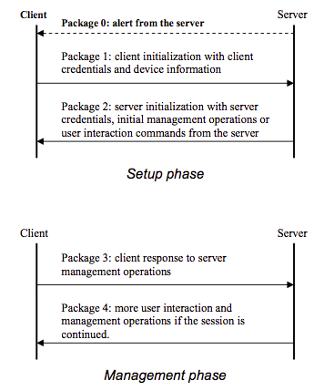

# 2.3 OMA DM Protocol packages OMA DM协议包
OMA DM Protocol consists of two parts: setup phase (authentication and device information exchange) and management phase. Management phase can be repeated as many times as the server wishes. Management sessions may start with Package 0 (the trigger). Trigger may be out-of-band depending on the environment and it is specified in DM Notification Initiated Session [DMNOTI]. 
OMA DM协议由两部分组成：建立阶段（认证和设备信息交换）和管理阶段。 管理阶段可以重复服务器所希望的次数。 管理会话可以从软件包0（触发器）开始。 根据环境，触发可以是带外的，并且它在DM通知发起的会话[DMNOTI]中指定。

[DMNOTI]:“OMA Device Management Notification Initiated Session, Version 1.2”. Open Mobile Alliance .
OMA-TS-DM_Notification-V1_2. URL:http://www.openmobilealliance.org

The following chart depicts the two phases. 
下图描述了两个阶段。

The Management Phase consists of a number of protocol iterations. The content of the package sent from the server to the client determines whether the session must be continued or not. If the server sends management operations in a package that need responses (Status or Results) from the client, the management phase of the protocol continues with a new package from client to server containing the client’s responses to those management operations. The response package from client starts a new protocol iteration. The server can send a new management operation package and therefore initiate a new protocol iteration as many times as it wishes. 
管理阶段包括多个协议迭代。从服务器发送到客户端的包的内容确定会话是否必须继续。如果服务器在需要来自客户端的响应（状态或结果）的包中发送管理操作，则协议的管理阶段将从客户端到服务器的包含客户端对这些管理操作的响应的新包中继续。客户端的响应包开始新的协议迭代。服务器可以发送新的管理操作包，并且因此发起所需次数的新的协议迭代。

During the management phase when a package from server to client does not contain management operations or a challenge, the client will create a package containing only Status for SyncHdr as a response to the package received from server. In this case the entire response package MUST NOT be sent and the protocol ends. A server MUST send response packages to all client packages. 
在管理阶段，当从服务器到客户端的包不包含管理操作或挑战时，客户端将创建只包含SyncHdr状态的包作为对从服务器接收的包的响应。在这种情况下，整个响应包必须不被发送，协议结束。服务器必须向所有客户端软件包发送响应包。

Processing of packages can consume unpredictable amount of time. Therefore the OMA DM Protocol does not specify any timeouts between packages. 
处理包可能消耗不可预测的时间量。因此，OMA DM协议不指定包之间的任何超时。

If not enclosed by a Sequence or Atomic command, the client and server MAY freely choose the execution order of the management commands sent in the package. However, when execution order is required by the parent management command, commands MUST be executed in the order they were sent. 
如果没有被序列或原子命令包围，客户端和服务器可以自由选择在包中发送的管理命令的执行顺序。 但是，当父管理命令需要特定执行顺序时，必须按照它们被发送的顺序执行命令。

Client MUST NOT send any commands other than Replace command containing DevInfo, Results and Alert to the server. 
客户端必须不向服务器发送除包含DevInfo，Results和Alert的Replace命令以外的任何命令。

## 2.3 Session Abort 会话中止
### 2.3.1 Description 描述
Either the client or the server may decide to abort the session at any time. Reasons for session abort may be server shutdown, client power-down, user interaction on the client, etc. In this case it is best if the aborting party sends a SESSION ABORT Alert. It is RECOMMENDED that the message also includes Status and Results of all the management commands that the aborting party executed before the abort operation. 
If a recipient of a Session Abort sends a response to this message, the response is ignored. 
客户端或服务器可以决定在任何时候中止会话。会话中止的原因可以是服务器关闭，客户机关机，客户机上的用户交互等。在这种情况下，最好是中止方发送SESSION ABORT警报。推荐该消息还包括中止方在中止操作之前执行的所有管理命令的状态和结果。

Some cases of session aborts are not controllable, for example if the client goes out of coverage or its battery runs down. Servers and clients must be prepared for non-signalled session aborts as well. The requirements stated above are intended to reduce situations in which one party times out on a response from the other. 
Implementations are possible (e.g. OBEX) in which the request/response roles of the transport binding may be reversed, i.e. the SyncML Client is a transport-level server, and the SyncML Server is a transport-level client. In this case, the recommendation in Section 8.1.1 above may not apply. 