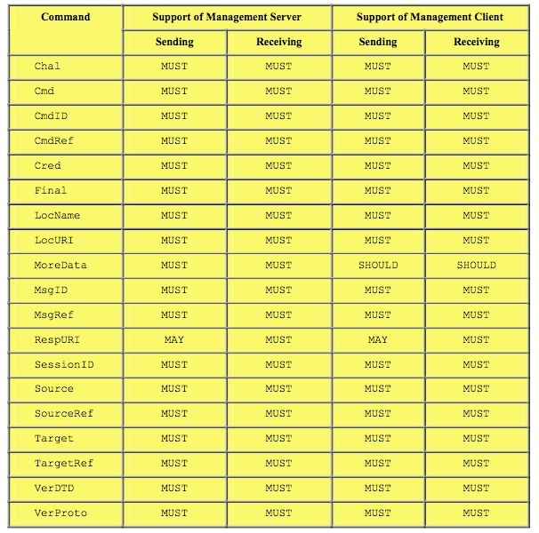

# 4.1 Mark-up Language Description 标记语言说明

Examples in this section make use of XML snippets. They are not intended to be complete XML documents. They are only provided to illustrate an example usage of the element type in question.<br/>
本节中的示例使用XML片段。它们不是要作为完整的XML文档。它们仅被提供来展示所讨论的元素类型的示例使用。

Restrictions listed in this document are in addition to the restrictions listed in [REPPRO].<br/>
本文档中列出的限制是除[REPPRO]中列出的限制外的限制。

### 4.1.1 Common Use Elements 常用元素
The following are common element types used by numerous other element types. The table lists the mandatory and optional elements that servers and clients send and receive.<br/>
以下是许多其他元素类型使用的常见元素类型。该表列出了服务器和客户端发送和接收的必需和可选元素。

### 4.1.1.1 Archive
Restrictions: This element is not used in OMA Device Management Protocol.<br/>
限制：此元素不在OMA设备管理协议中使用。

### 4.1.1.2 Chal
Restrictions: When using syncml:auth-md5 or syncml:auth-MAC, the Meta Format for the NextNonce element MUST be specified and it MUST be b64.<br/>
限制：当使用syncml：auth-md5或syncml：auth-MAC时，必须指定NextNonce元素的元格式，并且必须为b64。

Example: The following is an example of a "MD-5" authentication challenge. The password and userid are requested to be Base64 character encoded. The type and format of the authentication scheme are specified by the meta-information in the Meta element type.<br/>
示例：以下是“MD-5”身份验证质询的示例。请求对密码和用户标识进行Base64字符编码。认证方案的类型和格式由Meta元素类型中的元信息指定。
```
<Status>
  <MsgRef>0</MsgRef>
  <Cmd>SyncHdr</Cmd> 
  <TargetRef>http://www.datamgr.org/servlet/manageit</TargetRef> 
  <SourceRef>IMEI:001004FF1234567</SourceRef>
  <Chal>
    <Meta>
      <Type xmlns=’syncml:metinf’>syncml:auth-md5</Type>
      <Format xmlns=’syncml:metinf’>b64</Format>
      <NextNonce xmlns=’syncml:metinf’>ZG9iZWhhdmUNCg==</NextNonce>
    </Meta>
  </Chal>
  <Data>401</Data>
</Status>
```