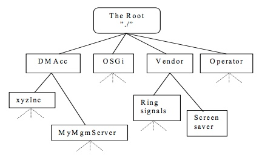

# 8.1 The Management Tree 管理树
Each device that supports OMA DM MUST contain a Management Tree. The Management Tree organizes all available Management Objects in the device as a hierarchical tree structure where all Nodes can be uniquely addressed with a URI. The following figure shows an example Management Tree. 
支持OMA DM的每个设备必须包含一个管理树。 管理树将设备中的所有可用管理对象组织为分层树结构，其中所有节点可以使用URI唯一地寻址。 下图显示了一个示例管理树。

The URI for a node is constructed by starting at the device root and, as the tree is traversed down to the Node in question, each Node name is appended to the previous ones using “/” as the delimiting character. In the OMA DM protocol [DMPRO], the URI used to address Nodes MUST be a relative URI.
 
通过在设备根处开始构建节点的URI，并且当树向下遍历到所讨论的节点时，使用“/”作为定界字符将每个节点名称附加到先前的节点。在OMA DM协议[DMPRO]中，用于寻址节点的URI必须是相对URI。

To access the xyzInc Node in the Management Tree above, a server would present the address: ./DMAcc/xyzInc, or DMAcc/xyzInc. Note that the URI MUST be given with the root of the Management Tree as the starting point. 
要在上面的管理树中访问xyzInc节点，服务器将显示地址：./DMAcc/xyzInc或DMAcc/xyzInc。注意，URI必须以管理树的根作为起点给出。

URI used in OMA DM MAY be treated and interpreted as case sensitive. Node names SHOULD be chosen such that resulting URI strings differ in more than just the case of individual letters. Implementations, even if treating and interpreting URIs as case insensitive, SHALL preserve the case of symbols in the names of dynamically created Nodes. 
在OMA DM中使用的URI可以被处理和解释为区分大小写。选择节点名称应当注意，应使得生成的URI字符串不仅仅是个别字母大小写的区别。实现过程中，即使处理和解释URI不区分大小写，必须保留动态创建的节点名称中的符号的大小写。

Client device SHOULD indicate the Node name case sensitivity in the DDF using the CaseSense element as specified in Section 8.5.4.3. 
客户端设备推荐使用第8.5.4.3节中指定的CaseSense元素在DDF中指示节点名是否称区分大小写。

URI used in OMA DM MUST use the UTF-8 character set. 
OMA DM中使用的URI必须使用UTF-8字符集。

The following restrictions on URI syntax are intended to simplify the parsing of URI's. 
URI语法的以下限制旨在简化URI的解析。
* A URI MUST NOT end with the delimiter "/". Note that this implies that the root Node MUST be denoted as "." and not "./". 
URI不能以定界符“/”结束。注意，这意味着根节点必须被表示为“.”。 并不是 ”./”。
* A URI MUST NOT be constructed using the character sequence "../". The character sequence "./" MUST NOT be used anywhere else but in the beginning of a URI. 
URI绝不能使用字符序列“../”构造。 字符序列“./”不得在任何其他位置使用，除了在URI的开头。

