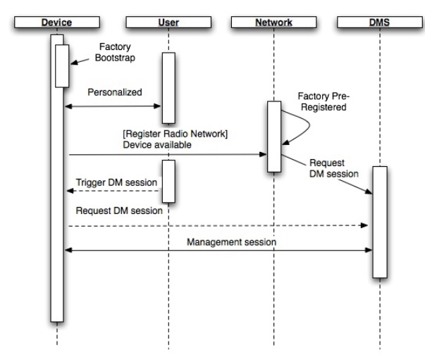

#3.1 Bootstrapping 初始化
##3.1.1 Bootstrap scenarios 初始化场景
OMA DM devices need to be able to function in diverse network environments and using a large set of protocols. This makes it hard to find a ‘one size fits all’ solution to the bootstrap problem. This section starts with the most basic requirements for bootstrap and continues to define three different processes for bootstrap.  
OMA DM设备需要能够在不同的网络环境中工作并使用大量的协议。这使得很难找到一个“一刀切”的解决方案引导问题。本节从初始化的最基本的要求开始，并继续定义三个不同的初始化进程。

##3.1.1.1 Requirements 需求
An OMA DM solution capable of transforming an empty, clean device into a state where it is able to initiate a management session needs to address these requirements. 
能够将空的，干净的设备转换成能够发起管理会话的状态的OMA DM解决方案需要解决这些需求。
* Re-use technology (WAP Push) 
重用技术（WAP Push）
* Tightly standardized and simple Highly interoperable 
严格标准化和简单高度互操作
* Self sufficient and complete 
自给自足，完整
* Secure 
安全
* Data format should be XML based 
数据格式应基于XML
* Content mappable to OMA DM management objects 
可映射到OMA DM管理对象的内容
* Transport encoding should be [WBXML1.1], [WBXML1.2], [WBXML1.3] 
传输编码应为[WBXML1.1]，[WBXML1.2]，[WBXML1.3]

##3.1.1.2 Solutions 解决方案
This document defines three different ways to perform the bootstrap process. 
本文档定义了三种不同的方式来执行初始化过程。

* Customized bootstrap 自定义初始化 
Devices are loaded with OMA DM bootstrap information at manufacture. Also referred to as factory bootstrap. 
设备在制造时加载OMA DM引导信息。也称为工厂初始化。
* Server initiated bootstrap 服务器启动的初始化 
Server sends out bootstrap information via some push mechanism, e.g. WAP Push or OBEX. Server must receive the device address/phone number beforehand. 
服务器经由一些推送机制发送引导信息，例如，WAP推送或OBEX。服务器必须事先接收设备地址/电话号码。
* Bootstrap from smartcard 从智能卡初始化 
The smartcard is inserted in the device and the DM client is bootstrapped from the smartcard. 
将智能卡插入设备中，并且从智能卡初始化DM客户端。

###3.1.1.2.1 Customized bootstrap 自定义初始化

This is a convenient way to bootstrap a device from an end user perspective because the user does not have to do anything. In this scenario, an operator orders the devices pre-configured from a device manufacturer. All the information about the operator’s network and device management infrastructure is already in the devices when they leave the factory. Another advantage of this method is that it is very secure. There is no need to transport sensitive commands and information, e.g. shared secrets, over the air. The method is however not very flexible and not all device manufacturers may provide this service. Not all devices are sourced via the operator. In this scenario, either the DM server or the Client initiates an OMA DM session after user personalizes and bootstraps the Device. If the server initiates management session, the Server is informed about Device address or phone number previously. 
这是从最终用户角度初始化设备的方便方法，因为用户不必做任何事情。在这种情况下，操作员从设备制造商订购预先配置的设备。有关运营商的网络和设备管理基础设施的所有信息在设备出厂时已在设备中。这种方法的另一个优点是它是非常安全的。没有传输敏感的命令和信息，例如，在空下载中传输机密数据。 然而，该方法不是非常灵活，并且并非所有设备制造商都可以提供这种服务。并非所有设备都通过运营商采购。在这种情况下，DM服务器或客户端在用户个性化并初始化设备后启动OMA DM会话。如果由服务器启动管理会话，则设备地址或电话号码需在之前告知服务器。

Figure gives an overview of this scenario. 
图给出了这种情况的概述。

####3.1.1.2.1.1 Bootstrap from smartcard 从智能卡的初始化
This is a convenient way to bootstrap a device from an end user perspective because the user does not have to do anything. In this scenario the DM client is able to obtain the information necessary to bootstrap it from the smartcard. There is no need to transport sensitive bootstrap commands and information, e.g. shared secrets, over the air. The smartcard is secure, ensuring that the bootstrapping commands have been authorized. A device supporting the smartcard can be bootstrapped for DM without necessarily being purchased from the operator. In this scenario, either the DM Server or the Client initiates an OMA DM session after user bootstraps and personalizes the Device. If Server initiates management session, the Server is informed about Device address or phone number previously. 
这是从最终用户角度初始化设备的方便方法，因为用户不必做任何事情。 在这种情况下，DM客户端能够从智能卡获得初始化它所需的信息。不需要传输敏感的初始化命令和信息，例如在空下载中传输机密数据。智能卡是安全的，可以确保引导命令已被授权。支持智能卡的设备可以为DM初始化而不必从运营商处购买。在这种情况下，DM服务器或客户端在用户初始化和个性化设备后启动OMA DM会话。如果服务器启动管理会话，则设备地址或电话号码在之前告知服务器。

